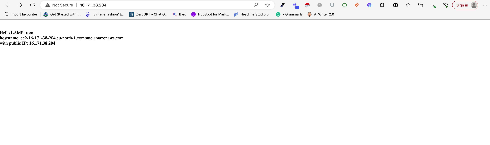

# WEBSTACK: IMPLEMENTATION OF the LAMP STACK on AWS

The LAMP stack is a collection of open source and free software bundles which by web developers around the world use to write software of different types and application. Where the accronym L stands for the Linux operating system, A is the Apache server the most popular server software, M stands for MYSQL (Also one of the most popular Database server) and P for PHP backend programming languauge.

Pre-requisites for Installing Apache server.

#### Step 0:

Installed an E2C instance and SSH into the server


## Installing Apache and Updating the Firewall

Apache HTTP Server is one of the most used servers in the world. More than 60% of the world's server is Apache. Most especially web developers use this server because it is simple to setup and open source. Ther are other servers which are also in use like IIS by Microsoft, Nginx 

Use the code below to install Apache on your AWS instance

#update a list of packages in package manager

```
sudo apt update
```
> Command output


### Step 1: Installing Apache server

#run apache2 package installation
```
sudo apt install apache2
```

#### Output


Run the command below to verify that Apache is running fine
```
sudo systemctl status apache2
```

#### Output


The status indicates Active: running => showing that the apache server is now running, and we can test with the following commands which will dipsplay the content of the server file

Use the command
```
curl http://localhost:80 
```

OR
```
curl http://127.0.0.1:80 
```

> localhost:80 indicates that we are calling the local DNS server to to display the content of the server, while 127.0.0.1:80 is using the IP address of the server to check the details of the server.
We are using port 80, which is HTTP for web servers

### Checking if Apache Server is working using our IPv4 (from AWS instance) on the browser 

Visit your browser and type:
http://<Public-IP-Address>:80

##### Output


Use the curl command below to check your Public IP address without going to the AWS console
```
curl -s http://169.254.169.254/latest/meta-data/public-ipv4
```

##### Output


## Installing MySQL

### Step 2: Installing MySQL on the server


We now have a Webserver, but for a complete application, we also need to store information and data, so we need a DataBase Management System (DBMS) to help with this, in this case MySQL

Let's install MySQL on our server

```
sudo apt install mysql-server
```

Use the command below to log into the Database Admnistation as user root. Right now our Database is not secure and anyone can have access by just typing the command below.

```
sudo mysql
```

##### Output


Let us firstly secure the Database by running the secure default script to lock anyone that tries to have access with the command below.

```
ALTER USER 'root'@'localhost' IDENTIFIED WITH mysql_native_password BY 'PassWord.1';
```

##### Output


If you try to login now, except as root. It is time to start the interactive script for securing the DB. 

```
sudo mysql_secure_installation
```

##### Output


## Installing PHP

### Step 3: Installing PHP on the server

We now have Apache and MySQL installed on our server. But we still need a server side language to complete the STACK, since we want a LAMP STACK application it will be imcomplete without the server side programming Language in this case PHP

Let's install PHP now. Paste the command below on your terminal

```
sudo apt install php libapache2-mod-php php-mysql
```

##### Output


Use the command php -v to check the version of PHP installed or if PHP is already installed

```
php -v
```

##### Output


At this point, our LAMP STACK has now been completed, Linux, Apache, MySQL, PHP (LAMP)

### NOTE: You can check the configuration of VirtualHost (VHosts) on the server. ==> [VIRTUAL HOST](https://httpd.apache.org/docs/2.4/vhosts/)

Also use TO check the configuration of your server
```
apachectl -S
```

# Creating a virtual Host for your Website Using Apache

### Step 4: Creating a Virtual Host (VHost) using Apache Server fro hosting your website

In this project we will be using a domain name called projectlamp, but ofcourse you can have anyname of your choice.

By default document root that serve the website are on the directory **/var/www/html** which comes with apache on Ubuntu 2X.X.X 

Let us create our project folder using the project name by navigating into the folder **/var/www/** and create **projectlamb** directory

or we can use the command 

``` 
sudo mkdir /var/www/projectlamp
```

Also use the command

```
sudo chown -R $USER:$USER /var/www/projectlamp
```
to assign ownership of the folder to the current user. 

> Let's open and create a new configuration file for the `sites-available` directory.

```
sudo vi /etc/apache2/sites-available/projectlamp.conf
```
This command will open and create an empty file projectlamp.conf which will host the info below

> use the `i` insert mode, then paste the code below

And add the following line of code in the `projectlamp.conf` file 
```
<VirtualHost *:80>
    ServerName projectlamp
    ServerAlias www.projectlamp 
    ServerAdmin webmaster@localhost
    DocumentRoot /var/www/projectlamp
    ErrorLog ${APACHE_LOG_DIR}/error.log
    CustomLog ${APACHE_LOG_DIR}/access.log combined
</VirtualHost>
```
then `:wq!` then press enter to save

Let us check the content of the `sites-available` directory the directory should now have the projectlamp.conf 


> Summary: With the above Virtual Host Config, we are now saying Apache should server projectlamp using the /var/www/projectlamp as it's root directory.

*You can comment out the first 2 lines (ServerName & Server Alias)* if you don't want to use domain name to access the server using the # symbol.

Let's now enable the new virtual host by running the command

```
sudo a2ensite projectlamp
```

*Fun fact, i think the meaning of a2ensite could be "Apache2 enable Site (a2ensite)" | Or what do you think?, that makes sense to me*

Anyway, remember we checked the content of the sites-available directory we saw a file name 000-default.conf, we need to disable this file because it is responsible for displaying the default files that comes pre-installed on Apache2.

Use the command 

```
sudo a2dissite 000-default
```

We also need to run the command to ensure there are no config issues if we get the result `Syntax OK` then everything looks good.

```
sudo apache2ctl configtest
```

Finally, let's reload the apache server 

```
sudo systemctl reload apache2
```


## Enable PHP on the Website

### Step 5: Enabling PHP on the website

Apache by default looks for the index.html file on the server called Directoryindex, this is the file that get called/executed when the directory is called to server the pages hosted in it.

Even though we might have an index.php file, the index.html will get called first by default, which can be used during maintainance mode to inform the users what is going on.

To change the defualt behaviour of the Directoryindex, we need to edit the file /etc/apache2/mods-enabled/dir.conf

run the command below:
```
sudo vim /etc/apache2/mods-enabled/dir.conf
```

```
<IfModule mod_dir.c>
        DirectoryIndex index.html index.cgi index.pl index.php index.xhtml index.htm
</IfModule>
```

##### Output


After editing the file, you can save & close the file then restart apache server to effect changes

```
sudo systemctl reload apache2
```

```
sudo echo 'Hello LAMP from hostname' $(curl -s http://169.254.169.254/latest/meta-data/public-hostname) 'with public IP' $(curl -s http://169.254.169.254/latest/meta-data/public-ipv4) > /var/www/projectlamp/index.html
```

We can use the above code to create an index.html file in teh /var/www/projectlamp directory to test our server.

##### Output


And BOOM!!! Congratulatios, We have our first website hosted on AWS 

