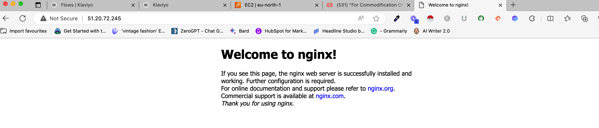

# WEBSTACK: IMPLEMENTATION OF the LEMP STACK on AWS

The LEMP stack is a collection of open source and free software bundles which web developers around the world use to write software of different types and application. Where the accronym L stands for the Linux operating system, E is the Nginx server the most popular server software, M stands for MYSQL (Also one of the most popular Database server) and P for PHP backend programming languauge.

Pre-requisites for Installing Nginx server.

#### Step 0:

For this project, it is better to use a differnet AWS instance. Kindly create a new one, which by now you already know how todo.
Once it has been installed and .pem key download, navigate into the directory housing the key and SSH into the server.
Also please make sure you have port 80 active on the instance for this project.


## Installing Nginx Web Server


### update a list of packages in package manager and install nginx

```
sudo apt update
sudo apt install nginx
```
> Command output


To verify and test that Nginx has been successfully installed and working, copy and paste the following code

```
sudo systemctl status nginx
```

> Command output


Let us check how we can access our server locally on our Ubuntu shell using 

```
curl localhost:80 
curl http://127.0.0.1:80
```


We can now check the result on our browser and see if the server displays th following information, if it does, then Nginx worked using the http://<Public-IP-Address>:80 
replacing the <public-IP-address> with the IP address from your provider in this case AWS.



You can get your public address information on the AWS panel or use the command
```
curl -s http://169.254.169.254/latest/meta-data/public-ipv4
```
> Command output


## Installing MySQL

### Step 2: Installing MySQL on the server


We now have a Webserver, but for a complete application, we also need to store information and data, so we need a DataBase Management System (DBMS) to help with this, in this case MySQL

Let's install MySQL on our server

```
sudo apt install mysql-server
```

Use the command below to log into the Database Admnistation as user root. Right now our Database is not secure and anyone can have access by just typing the command below.

```
sudo mysql
```

##### Output


Let us firstly secure the Database by running the secure default script to lock anyone that tries to have access with the command below.

```
ALTER USER 'root'@'localhost' IDENTIFIED WITH mysql_native_password BY 'PassWord.1';
```

##### Output


If you try to login now, except as root. It is time to start the interactive script for securing the DB. 

```
sudo mysql_secure_installation
```

##### Output


## Installing PHP

### Step 3: Installing PHP on the server

We now have Nginx and MySQL installed on our server. But we still need a server side language to complete the STACK, since we want a LEMP STACK application it will be imcomplete without the server side programming Language in this case PHP

Let's install PHP now. Paste the command below on your terminal

```
sudo apt install php-fpm php-mysql
```

##### Output


Use the command php -v to check the version of PHP installed or if PHP is already installed

```
php -v
```

##### Output


At this point, our LEMP STACK has now been completed, Linux, Nginx, MySQL, PHP (LEMP)


## Configuring Nginx to use PHP Processor

### Step 4: Configuring Nginx to use PHP Processor on the server

Similar to Apache's virtual host (Refresher: Allows you host more than one website on the server), Nginx has a server block(s) that encapsulate configuration details allowing you to host multiple website on a single server.

Nginx has one server block by default and servers the default directory /var/www/html. This works well for a single website, however for multiple websites, we might need to make use of the /sites-available diretory similar to that of Apache.

We need to create a directory in the /var/www folder and do the configuration settings.

Let's create a new project "projectLEMP" in the /www/ folder 

```
sudo mkdir /var/www/projectLEMP
```

We will now assign the ownership of the directory with the $USER environment variable to the current user

```
sudo chown -R $USER:$USER /var/www/projectLEMP
```

Next is to open a new configuration file in the `sites-available` directory of the 

```
sudo vi /etc/nginx/sites-available/projectLEMP
```

Then copy and paste the following in the open file above and save the file when done.

```
#/etc/nginx/sites-available/projectLEMP

server {
    listen 80;
    server_name projectLEMP www.projectLEMP;
    root /var/www/projectLEMP;

    index index.html index.htm index.php;

    location / {
        try_files $uri $uri/ =404;
    }

    location ~ \.php$ {
        include snippets/fastcgi-php.conf;
        fastcgi_pass unix:/var/run/php/php8.1-fpm.sock;
     }

    location ~ /\.ht {
        deny all;
    }

}

```

Let's take out time to understand what each of the lines above mean

listen: This tells the server what port to listen on, port 80 which is the default for HTTP

root: This defines the default document root that contains all the website files

index: Defines the order in which Nginx will priortize the index files. Common practise ensure index.html has more precedence than index.php file

servername: Indicates which domain name and/ IP address the server block should point to

location / : The first location block includes a `try_files` directives and then it checks for existence of files or directories matching the URI request. If Nginx doesn't find the files it returns a 404 error

location ~ \.php$ : The location block does the actual PHP processing by pointing Nginx to the fastcgi-php.conf configuration file, and the php8.1-fpm.sock file which declares what sock is associated with the php-fpm

location ~ /\.ht : This location is the last one that deals with the .htaccess file which Nginx does not process.
By adding the `deny all` if any .htaccess file finds it's way 

Let's activate the configuration we just did by linking the config file from Nginx's `sites-enabled` directory.

```
sudo ln -s /etc/nginx/sites-available/projectLEMP /etc/nginx/sites-enabled/
```

##### Output


The above comand tells Nginx to use the projectLEMP config file when next it is loading.

Checking to see if there are any errors

```
sudo nginx -t
```

##### Output


The above output result shows that the configuration is fine and good to go.

Next is to disable the default Nginx config file currently listening on port 80, to do this, run

```
sudo unlink /etc/nginx/sites-enabled/default
```

Let's reload nginx for the changes to take effect

```
sudo systemctl reload nginx
```


We can run this code to create a sample index.html file which displays the hostname and public IP address of the server.

```
sudo echo 'Hello LEMP from hostname' $(curl -s http://169.254.169.254/latest/meta-data/public-hostname) 'with public IP' $(curl -s http://169.254.169.254/latest/meta-data/public-ipv4) > /var/www/projectLEMP/index.html
```

##### Output


## Testing PHP with Nginx

### Step 5: Testing PHP with the Nginx server

We will be writing a very basic php information file. Use the `nano /var/www/projectLEMP/info.php` and paste the following code

```
<?php
phpinfo();
```

##### Output


Always ensure you remove the php info file from the server using `sudo rm /var/www/projectLEMP/info.php` command.


## Retrieving data from MySQL database

### Step 6: Writing code to retrieve data from the MySQL DB

Let us create a simple todo list application, first the database.

```
sudo mysql
```

Then, create a database using the following command

```
create database TODO;
```

```
show databases;
```

##### Output


Next is to create a user that will have access or priviledges to the database we just created. We are defining the user 'afeez_user' and password -> 'Password1' using this command

```
CREATE USER 'afeez_user'@'%' IDENTIFIED WITH mysql_native_password BY 'PassWord.1';
```

After this, let's grant permission to the user afeez_user to

##### Output


```
GRANT ALL ON TODO.* TO 'afeez_user'@'%';
```

The above command will allow 'afeez_user' full priviledge to work on the TODO database while preventing the user from modifying or creating other databases on the server.

Login with the code `sudo mysql -u afeez_user -p`

```
CREATE TABLE TODO.todo_list (item_id INT AUTO_INCREMENT,content VARCHAR(255),PRIMARY KEY(item_id));
```

Adding some sample data into the table todo_list 

```
INSERT INTO TODO.todo_list (content) VALUES ("My first important item");
INSERT INTO TODO.todo_list (content) VALUES ("My second important item");
INSERT INTO TODO.todo_list (content) VALUES ("My third important item");
INSERT INTO TODO.todo_list (content) VALUES ("One more important item");
```

```
SELECT * FROM TODO.todo_list; 
```

##### Output


It is time to now create a file a php file to access the databse we just created and pull the record to be displayed on the browser.

```
<?php
$user = "afeez_user";
$password = "PassWord.1";
$database = "TODO";
$table = "todo_list";

try {
  $db = new PDO("mysql:host=localhost;dbname=$database", $user, $password);
  echo "<h2>TODO</h2><ol>";
  foreach($db->query("SELECT content FROM $table") as $row) {
    echo "<li>" . $row['content'] . "</li>";
  }
  echo "</ol>";
} catch (PDOException $e) {
    print "Error!: " . $e->getMessage() . "<br/>";
    die();
}
```

##### Output

